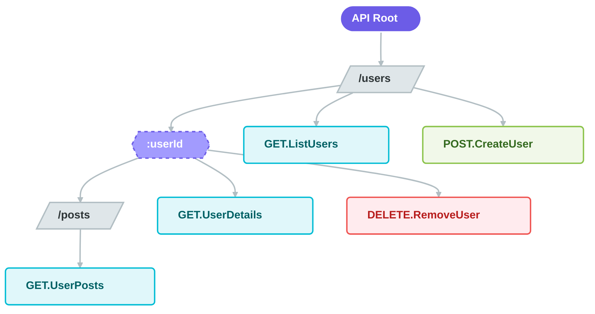

The `router` function allows you to structure your API client to mirror your backend's URL hierarchy. It groups multiple `FetchUnit`s into a single, nested object, providing a clean and organized way to access your endpoints.

### Visualizing the Router

The router creates a tree structure where leaves are executable requests and nodes are path segments.



### Defining a Router

You define a router by passing a base URL and a structure object.

```typescript
import { f } from '@freestylejs/fetch';

const api = f.router('https://api.example.com/v1', {
    // Static path: /v1/health
    health: {
        GET: f.builder()
    },
    
    // Nested path: /v1/users
    users: {
        // HTTP Method: GET /v1/users
        GET: f.builder().def_json(),
        
        // Dynamic path: /v1/users/:userId
        $userId: {
            // GET /v1/users/:userId
            GET: f.builder().def_json(),
            
            // DELETE /v1/users/:userId
            DELETE: f.builder(),
            
            // Deeply nested: /v1/users/:userId/posts
            posts: {
                 GET: f.builder().def_json()
            }
        }
    }
});
```

### Dynamic Paths (`$`)

To define a dynamic path segment (e.g., `/users/:id`), use a key starting with `$`.

-   **Syntax**: `$paramName` (e.g., `$userId`, `$slug`).
-   **Inference**: The router detects these keys and enforces them as required arguments in the `path` object when you call `query()`.
-   **Path Building**: The router automatically constructs the full URL by replacing the dynamic segment with the provided value.

#### Usage

```typescript
// Requesting: GET /v1/users/123
await api.users.$userId.GET.query({
    path: {
        userId: '123' // Type-safe and required
    }
});

// Requesting: GET /v1/users/123/posts
await api.users.$userId.posts.GET.query({
    path: {
        userId: '123'
    }
});
```

### Type Inference

To use your API client's type throughout your application (e.g., in React components or Vue composables), you can infer it using `GetRouterConfig`.

This type represents the **return values** of your endpoints, not the router structure itself.

```typescript
import type { GetRouterConfig } from '@freestylejs/fetch';

// Infers the shape of the responses
type ApiClient = GetRouterConfig<typeof api>;

// Example: Typing a function that uses the API
async function loadUser(id: string): Promise<ApiClient['users']['$userId']['GET']> {
    return await api.users.$userId.GET.query({ path: { userId: id } });
}
```

### Best Practices

1.  **Shared Configuration**: Create a "base builder" with common headers, middleware, and error handling, then reuse it for all routes.
2.  **Validation**: Use `.def_response()` on every route to ensure your runtime data matches your TypeScript types.